## Hi there 👋

<!--
**chrptos/chrptos** is a ✨ _special_ ✨ repository because its `README.md` (this file) appears on your GitHub profile.

Here are some ideas to get you started:

- 🔭 I’m currently working on ...
- 🌱 I’m currently learning ...
- 👯 I’m looking to collaborate on ...
- 🤔 I’m looking for help with ...
- 💬 Ask me about ...
- 📫 How to reach me: ...
- 😄 Pronouns: ...
- ⚡ Fun fact: ...
-->

## 🛠️ Tech Stack

**Languages & Frameworks**

**Infrastructure & Cloud**

**Tools & Environment**

<h2>📊 Stats</h2>

<picture>
  <source
    media="(prefers-color-scheme: dark)"
    srcset="./profile/stats-dark.svg"
  >
  
</picture>

<picture>
  <source
    media="(prefers-color-scheme: dark)"
    srcset="./profile/top-langs-dark.svg"
  >
  
</picture>

